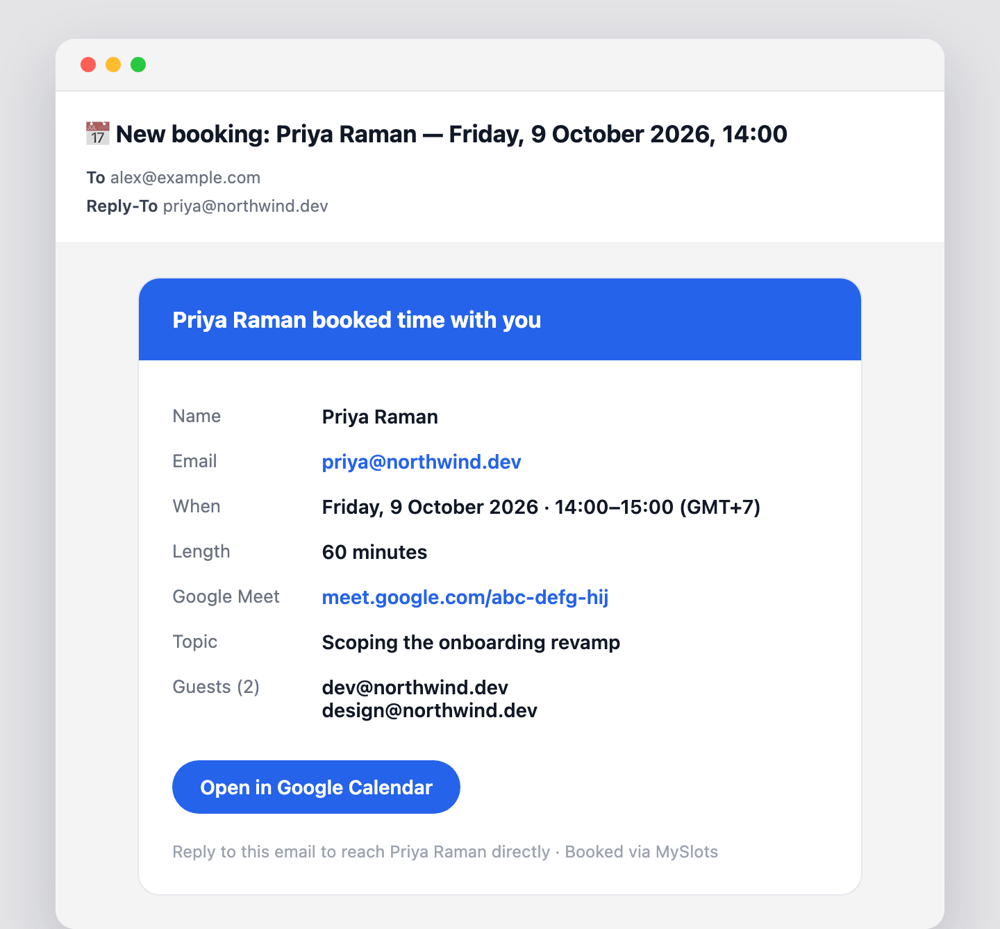
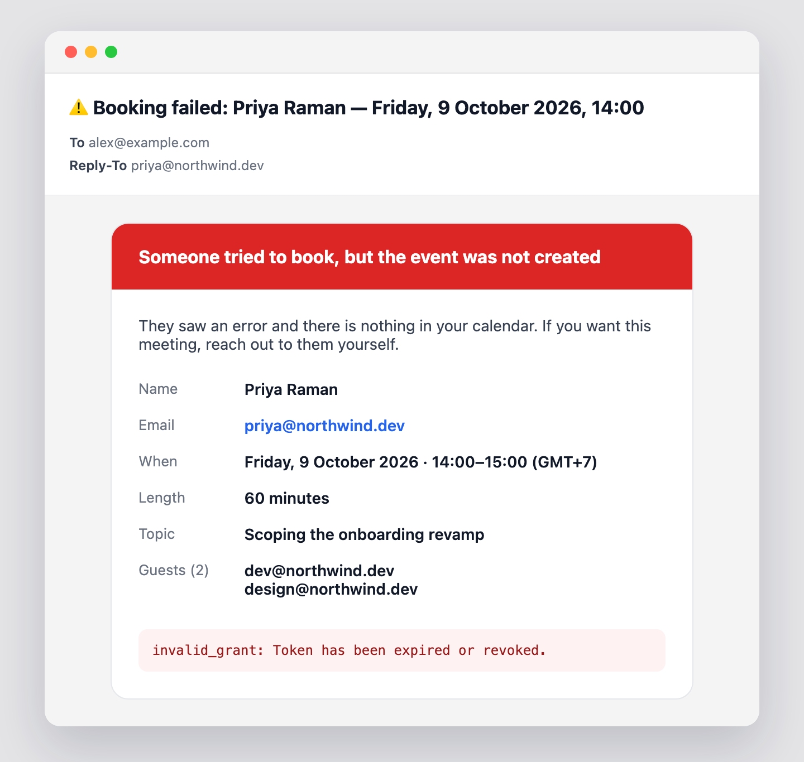

# MySlots

A self-hosted booking page for one person. Visitors pick a day, pick a time, and
land on your Google Calendar with an invite in their inbox — no third-party
scheduling service, no per-seat pricing, no account for them to create.

Next.js App Router + Tailwind + the Google Calendar API. Three small API routes,
two components, and no dependencies beyond `googleapis`.


<sub>Also: [dark theme](docs/screenshot-dark.png) · [details form](docs/screenshot-form.png) · [confirmation screen](docs/screenshot-confirmed.png) · [Find slots](docs/screenshot-find-slots.png)</sub>

---

## Why it looks like this

Most self-built booking pages render a week grid of unlabeled cells and leave you
to trace across from an hour column. This one answers the two questions people
actually arrive with, in order:

1. **Which days are open?** A strip of seven day cards, each showing how many
   slots are free. Days with nothing left are dimmed and unclickable. The strip
   starts at **today** — nobody books backwards — and a `Today` button brings you
   home after you page forward.
2. **What time?** Real buttons with the start time leading and the end time
   trailing underneath, smaller and quieter, so a screenful of options still has
   one thing to scan.

Once a time is chosen, the confirm bar sticks to the bottom of the viewport, and
the layout holds its height with skeletons while availability reloads — changing
the meeting length never makes the page jump under the cursor.

Every booking gets a **Google Meet** room on the invite, and the link is on the
confirmation screen too — no "I'll send a link" follow-up.

On the details form, **Add guest** reveals an email row on demand — nothing takes
up space until someone actually wants it — and every guest is added to the
calendar invite, so Google emails them all at once.

---

## The email Google will not send you

Google emails an invite to every attendee **except the account that created the
event** — and a self-hosted booking page creates events with your own
credentials. Every guide to building one of these stops there, which is why they
all share the same quiet failure: a stranger books you, and the first you hear
of it is a meeting sitting in your calendar that you never saw arrive.

So MySlots mails you itself, through the Gmail API, on the same OAuth consent it
already uses to read your calendar. No SMTP server, no transactional-email
vendor, no second account to keep alive.



Everything you need to decide whether to prepare is in the one card — who booked,
what they want to talk about, who else is coming — and `Reply-To` is set to the
booker, so answering them is one keystroke rather than a copy-paste.

**Failures get a letter too.** If the calendar write throws, the visitor sees an
error and walks away; without this, so does the meeting.



Sending is best-effort by design: a booking that reached your calendar is never
reported as failed because Gmail was unhappy. Problems are logged instead, and
the most common one — a refresh token minted before the `gmail.send` scope
existed — logs the exact fix.

> Both pictures are rendered from
> [`src/lib/booking-email-template.ts`](src/lib/booking-email-template.ts) by
> `pnpm mockup`, so the README cannot drift away from the mail that actually
> goes out.

---

## Links you can hand out

The picker keeps its whole state in the query string, so any view you are looking
at is a link you can send:

```
https://your-domain.com/?date=2026-10-09&duration=30&time=14:00
```

| Param | Meaning |
|---|---|
| `date` | `YYYY-MM-DD`. A day in the past or beyond `MAX_DAYS_AHEAD` falls back to the default view |
| `duration` | One of the meeting lengths in `config.ts` — 30, 60 or 90 by default |
| `time` | `HH:MM` in the host's zone. Opens with that slot already selected, if it is still free |

The address bar follows every day, length and slot you click, and a **Copy link**
button sits beside the slot count. Nothing is pre-generated: no routes, no
tokens, no stored links — just the state the page is already in. Updates go
through `history.replaceState`, so Back still returns visitors to wherever they
came from rather than walking them through every tile they tried.

---

## Send your free time as text

Sometimes a link is the wrong shape — the other person wants to see your week in
the chat, not open a page. **Find slots** (top right) writes it out
([screenshot](docs/screenshot-find-slots.png)):

```
Here’s Alex’s availability during this period 😊

23/Sep (Wednesday)
10:30 - 13:00

24/Sep (Thursday)
14:00 - 15:00

25/Sep (Friday)
No availability
—
Feel free to book a time that works for you here: your-domain.com
```

Pick a meeting length (30 / 60 / 90 or a custom number of minutes), a start and
an end date, and whether weekends count, then **Copy to Clipboard**. Free time
that touches is merged into one stretch, and stretches too short for the chosen
length are left out — so every line is a time the other person can really book.
The message re-renders instantly as you change the length or weekends; only a new
date range goes back to the calendar.

---

## Quick start

```bash
git clone https://github.com/tlejay/myslots.git
cd myslots
pnpm install
pnpm dev
```

Open <http://localhost:3000>. With no credentials configured the app runs in
**demo mode**: availability is synthesised deterministically, so you can click
through the entire flow — including the confirmation screen — before you touch
Google Cloud. Bookings made in demo mode are not written anywhere and no invite
is sent.

Then make it yours in [`src/lib/config.ts`](src/lib/config.ts):

```ts
export const HOST_NAME = 'Alex'          // "Schedule a call with Alex"
export const BRAND_NAME = 'MySlots'      // nav label
export const DURATIONS = [30, 60, 90]    // meeting lengths offered
export const WEEKDAY_HOURS = { start: 9, end: 20 }
export const WEEKEND_HOURS = { start: 10, end: 20 }
export const ADD_GOOGLE_MEET = true     // a Meet room on every invite
```

---

## Connect your Google Calendar

You need three secrets: an OAuth **client ID**, a **client secret**, and a
**refresh token** for the account whose calendar you are booking. Roughly ten
minutes, once.

### 1. Create a Google Cloud project and enable the API

1. Open the [Google Cloud Console](https://console.cloud.google.com/) and create
   a project (or pick an existing one).
2. **APIs & Services → Library** → search for **Google Calendar API** → **Enable**.

### 2. Configure the OAuth consent screen

1. **APIs & Services → OAuth consent screen**.
2. User type **External** is fine even for a personal calendar.
3. Fill in the app name and your email. You do **not** need to submit for
   verification — while the app is in *Testing*, add your own Google account
   under **Test users** and it will work indefinitely for you.
4. Add two scopes:
   - `https://www.googleapis.com/auth/calendar` — read free/busy, write events
   - `https://www.googleapis.com/auth/gmail.send` — mail you when someone books

> `gmail.send` is only used to send you the notification above. Skip it and
> everything else still works; the app just logs that it could not tell you.

> A *Testing* app issues refresh tokens that expire after 7 days. If you would
> rather not re-mint weekly, click **Publish app** on the consent screen. For an
> app that only ever authorises its own author, publishing needs no review.

### 3. Create OAuth credentials

1. **APIs & Services → Credentials → Create credentials → OAuth client ID**.
2. Application type: **Web application**.
3. Under **Authorised redirect URIs** add exactly:

   ```
   http://localhost:5789/oauth2callback
   ```

4. Copy the **Client ID** and **Client secret** into `.env.local`:

   ```bash
   cp .env.example .env.local
   ```

   ```ini
   GOOGLE_CLIENT_ID=1234567890-abcdefg.apps.googleusercontent.com
   GOOGLE_CLIENT_SECRET=GOCSPX-xxxxxxxxxxxxxxxx
   ```

### 4. Mint a refresh token

```bash
pnpm token
```

The script starts a one-shot server on port 5789 and prints a consent URL. Open
it, sign in as the calendar owner, approve, and the terminal prints:

```
GOOGLE_REFRESH_TOKEN=1//0gxxxxxxxxxxxxxxxxxxxxxxxx
```

Paste that into `.env.local`. Nothing is written to disk for you — the token
never leaves your terminal.

### 5. Point at a calendar

```ini
GOOGLE_CALENDAR_ID=you@example.com
```

Use the Google account's own address for its main calendar, or copy a secondary
calendar's ID from **Google Calendar → Settings → *calendar name* → Integrate
calendar → Calendar ID**. Leave it unset and the app falls back to `primary`.

Restart `pnpm dev`. The banner-free page now reads your real free/busy.

---

## How it works

Three endpoints, all under `src/app/api/`. The working-hours and slot-grid rules
they share live in `src/lib/booking-time.ts`, so the page never offers a time the
server would refuse.

### `GET /api/availability?date=YYYY-MM-DD&duration=60`

Generates every candidate slot for that date from the configured working hours,
asks the Calendar **free/busy** API what is taken, and labels each slot.

```jsonc
{
  "slots": [
    { "start": "2026-09-01T02:00:00.000Z", "display": "09:00", "available": true,  "reason": "available" },
    { "start": "2026-09-01T02:30:00.000Z", "display": "09:30", "available": false, "reason": "busy" },
    { "start": "2026-09-01T03:00:00.000Z", "display": "10:00", "available": false, "reason": "past" }
  ],
  "demo": false
}
```

Free/busy only returns *when* you are busy, never event titles or attendees — so
this endpoint cannot leak the contents of your calendar even though it is public.

The client fetches all seven visible days in parallel and counts the
`available` slots per day to fill in the day strip. Weeks already seen are kept,
so paging back is instant.

### `GET /api/availability/windows?from=YYYY-MM-DD&to=YYYY-MM-DD`

One free/busy query for the whole range, answered as free stretches per day —
what **Find slots** turns into text. Edges are snapped inward onto the slot grid
and anything already past is cut off. The range is clamped to today …
`MAX_DAYS_AHEAD`.

```jsonc
{
  "days": [
    { "date": "2026-09-23", "windows": [{ "start": "10:30", "end": "13:00" }] },
    { "date": "2026-09-25", "windows": [] }
  ]
}
```

### `POST /api/book`

```jsonc
// request — `topic` and `guests` are optional
{
  "startTime": "2026-09-01T02:00:00.000Z",
  "duration": 60,
  "name": "John",
  "email": "john@example.com",
  "topic": "Intro call",
  "guests": ["sam@example.com", "dana@example.com"]
}

// 200 — meetLink is null in demo mode, or if Google declined to create a room
{ "success": true, "meetLink": "https://meet.google.com/abc-defg-hij" }
```

Because the endpoint is public it re-validates every request server-side before
writing: the email must be well formed, the duration must be one you offer, the
time must be in the future, on the slot grid, inside working hours and within
`MAX_DAYS_AHEAD`, every guest address must
parse, there may be at most `MAX_GUESTS` (10) of them, and a second free/busy
check must still show the slot open. A slot taken between page load and submit
returns **409** rather than double-booking you.

Guests are lowercased and de-duplicated, and the booker's own address and the
host calendar are dropped from the list so nobody is invited twice.

On success it inserts the event with `sendUpdates: 'all'` and, when
`ADD_GOOGLE_MEET` is on, a Meet conference request — so Google emails the invite,
room included, to the booker and every guest — then sends the host the notification
Google leaves out.

---

## Deploy

The app is a stock Next.js project — Vercel, Netlify, Fly, a container, anything.
On Vercel:

```bash
vercel
```

Add `GOOGLE_CLIENT_ID`, `GOOGLE_CLIENT_SECRET`, `GOOGLE_REFRESH_TOKEN` and
`GOOGLE_CALENDAR_ID` under **Project → Settings → Environment Variables**, then
redeploy. `NOTIFY_EMAIL` is optional — set it to send booking notifications
somewhere other than the calendar's own address. The OAuth redirect URI stays `http://localhost:5789/oauth2callback` —
it is only ever used by `pnpm token` on your own machine, never in production.

---

## Time zones

Slots are built as literal wall-clock strings with a fixed offset
(`2026-09-01T09:00:00+07:00`), taken from `UTC_OFFSET` in `config.ts`. This is
exact for zones without daylight saving — Bangkok, Tokyo, Delhi, most of the
tropics.

If your zone observes DST, set `UTC_OFFSET` and `TIME_ZONE` to match, and update
`UTC_OFFSET` at each changeover, or replace the offset arithmetic in
`src/app/api/availability/route.ts` with a zone-aware library such as
[Temporal](https://tc39.es/proposal-temporal/docs/) or `date-fns-tz`. Visitors in
other zones always see the host's local hours, labelled with `TIME_ZONE_LABEL`.

---

## Security notes

- `.gitignore` blocks every `.env*` file except `.env.example`. Verify with
  `git ls-files | grep env` before your first push — a file already tracked stays
  tracked no matter what you add to `.gitignore` afterwards.
- The refresh token grants full read/write access to that calendar. Treat it like
  a password; revoke it any time at
  [myaccount.google.com/permissions](https://myaccount.google.com/permissions).
- There is no rate limiting. A public booking page is a public write endpoint —
  put it behind your host's rate limiter, or add a CAPTCHA, before pointing real
  traffic at it.

---

## Project layout

```
src/
  app/
    layout.tsx                    theme bootstrap + metadata
    page.tsx                      renders the booking flow at /
    globals.css                   design tokens, light + dark
    theme-toggle.tsx
    book/BookingFlow.tsx          the whole three-step flow
    book/FindSlots.tsx            free time as copyable text
    api/availability/route.ts     free/busy → labelled slots
    api/availability/windows/     free/busy → free stretches per day
    api/book/route.ts             validate → re-check → insert event
  lib/
    config.ts                     everything you are likely to change
    booking-time.ts               working hours, slot grid, free windows
    availability-text.ts          the Find slots message
    google-calendar.ts            OAuth client, demo-mode detection
    demo-availability.ts          synthetic busy blocks, no credentials needed
    booking-email.ts              sends the host notification through Gmail
    booking-email-template.ts     the markup of that email, on its own
scripts/
  get-refresh-token.mjs           pnpm token
  render-email-mockup.mjs         pnpm mockup — the README's email pictures
```

## License

MIT — see [LICENSE](LICENSE).
