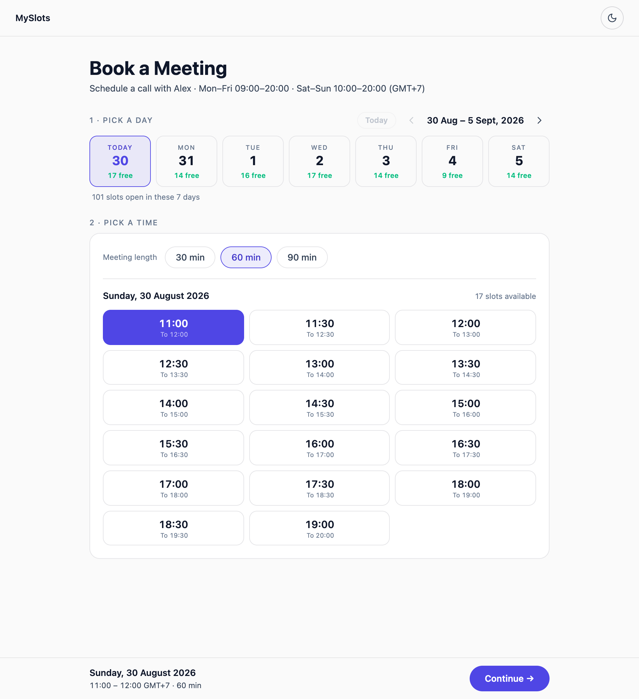

# MySlots

A self-hosted booking page for one person. Visitors pick a day, pick a time, and
land on your Google Calendar with an invite in their inbox — no third-party
scheduling service, no per-seat pricing, no account for them to create.

Next.js App Router + Tailwind + the Google Calendar API. Two API routes and one
component; the whole thing is under 800 lines.



<sub>Also: [dark theme](docs/screenshot-dark.png) · [confirmation screen](docs/screenshot-confirmed.png)</sub>

---

## Why it looks like this

Most self-built booking pages render a week grid of unlabeled cells and leave you
to trace across from an hour column. This one answers the two questions people
actually arrive with, in order:

1. **Which days are open?** A strip of seven day cards, each showing how many
   slots are free. Days with nothing left are dimmed and unclickable. The strip
   starts at **today** — nobody books backwards — and a `Today` button brings you
   home after you page forward.
2. **What time?** Real buttons with the start time leading and the end time
   trailing underneath, smaller and quieter, so a screenful of options still has
   one thing to scan.

Once a time is chosen, the confirm bar sticks to the bottom of the viewport, and
the layout holds its height with skeletons while availability reloads — changing
the meeting length never makes the page jump under the cursor.

---

## Quick start

```bash
git clone https://github.com/tlejay/myslots.git
cd myslots
pnpm install
pnpm dev
```

Open <http://localhost:3000>. With no credentials configured the app runs in
**demo mode**: availability is synthesised deterministically, so you can click
through the entire flow — including the confirmation screen — before you touch
Google Cloud. Bookings made in demo mode are not written anywhere and no invite
is sent.

Then make it yours in [`src/lib/config.ts`](src/lib/config.ts):

```ts
export const HOST_NAME = 'Alex'          // "Schedule a call with Alex"
export const BRAND_NAME = 'MySlots'      // nav label
export const DURATIONS = [30, 60, 90]    // meeting lengths offered
export const WEEKDAY_HOURS = { start: 9, end: 20 }
export const WEEKEND_HOURS = { start: 10, end: 20 }
```

---

## Connect your Google Calendar

You need three secrets: an OAuth **client ID**, a **client secret**, and a
**refresh token** for the account whose calendar you are booking. Roughly ten
minutes, once.

### 1. Create a Google Cloud project and enable the API

1. Open the [Google Cloud Console](https://console.cloud.google.com/) and create
   a project (or pick an existing one).
2. **APIs & Services → Library** → search for **Google Calendar API** → **Enable**.

### 2. Configure the OAuth consent screen

1. **APIs & Services → OAuth consent screen**.
2. User type **External** is fine even for a personal calendar.
3. Fill in the app name and your email. You do **not** need to submit for
   verification — while the app is in *Testing*, add your own Google account
   under **Test users** and it will work indefinitely for you.
4. Add the scope `https://www.googleapis.com/auth/calendar`.

> A *Testing* app issues refresh tokens that expire after 7 days. If you would
> rather not re-mint weekly, click **Publish app** on the consent screen. For an
> app that only ever authorises its own author, publishing needs no review.

### 3. Create OAuth credentials

1. **APIs & Services → Credentials → Create credentials → OAuth client ID**.
2. Application type: **Web application**.
3. Under **Authorised redirect URIs** add exactly:

   ```
   http://localhost:5789/oauth2callback
   ```

4. Copy the **Client ID** and **Client secret** into `.env.local`:

   ```bash
   cp .env.example .env.local
   ```

   ```ini
   GOOGLE_CLIENT_ID=1234567890-abcdefg.apps.googleusercontent.com
   GOOGLE_CLIENT_SECRET=GOCSPX-xxxxxxxxxxxxxxxx
   ```

### 4. Mint a refresh token

```bash
pnpm token
```

The script starts a one-shot server on port 5789 and prints a consent URL. Open
it, sign in as the calendar owner, approve, and the terminal prints:

```
GOOGLE_REFRESH_TOKEN=1//0gxxxxxxxxxxxxxxxxxxxxxxxx
```

Paste that into `.env.local`. Nothing is written to disk for you — the token
never leaves your terminal.

### 5. Point at a calendar

```ini
GOOGLE_CALENDAR_ID=you@example.com
```

Use the Google account's own address for its main calendar, or copy a secondary
calendar's ID from **Google Calendar → Settings → *calendar name* → Integrate
calendar → Calendar ID**. Leave it unset and the app falls back to `primary`.

Restart `pnpm dev`. The banner-free page now reads your real free/busy.

---

## How it works

Two endpoints, both under `src/app/api/`.

### `GET /api/availability?date=YYYY-MM-DD&duration=60`

Generates every candidate slot for that date from the configured working hours,
asks the Calendar **free/busy** API what is taken, and labels each slot.

```jsonc
{
  "slots": [
    { "start": "2026-09-01T02:00:00.000Z", "display": "09:00", "available": true,  "reason": "available" },
    { "start": "2026-09-01T02:30:00.000Z", "display": "09:30", "available": false, "reason": "busy" },
    { "start": "2026-09-01T03:00:00.000Z", "display": "10:00", "available": false, "reason": "past" }
  ],
  "demo": false
}
```

Free/busy only returns *when* you are busy, never event titles or attendees — so
this endpoint cannot leak the contents of your calendar even though it is public.

The client fetches all seven visible days in parallel and counts the
`available` slots per day to fill in the day strip.

### `POST /api/book`

```jsonc
// request
{
  "startTime": "2026-09-01T02:00:00.000Z",
  "duration": 60,
  "name": "Sam Rivera",
  "email": "sam@example.com",
  "topic": "Intro call"
}

// 200
{ "success": true }
```

Because the endpoint is public it re-validates every request server-side before
writing: the email must be well formed, the duration must be one you offer, the
time must be in the future and inside working hours, and a second free/busy
check must still show the slot open. A slot taken between page load and submit
returns **409** rather than double-booking you.

On success it inserts the event with `sendUpdates: 'all'`, so Google emails the
invite to both of you.

---

## Deploy

The app is a stock Next.js project — Vercel, Netlify, Fly, a container, anything.
On Vercel:

```bash
vercel
```

Add `GOOGLE_CLIENT_ID`, `GOOGLE_CLIENT_SECRET`, `GOOGLE_REFRESH_TOKEN` and
`GOOGLE_CALENDAR_ID` under **Project → Settings → Environment Variables**, then
redeploy. The OAuth redirect URI stays `http://localhost:5789/oauth2callback` —
it is only ever used by `pnpm token` on your own machine, never in production.

---

## Time zones

Slots are built as literal wall-clock strings with a fixed offset
(`2026-09-01T09:00:00+07:00`), taken from `UTC_OFFSET` in `config.ts`. This is
exact for zones without daylight saving — Bangkok, Tokyo, Delhi, most of the
tropics.

If your zone observes DST, set `UTC_OFFSET` and `TIME_ZONE` to match, and update
`UTC_OFFSET` at each changeover, or replace the offset arithmetic in
`src/app/api/availability/route.ts` with a zone-aware library such as
[Temporal](https://tc39.es/proposal-temporal/docs/) or `date-fns-tz`. Visitors in
other zones always see the host's local hours, labelled with `TIME_ZONE_LABEL`.

---

## Security notes

- `.gitignore` blocks every `.env*` file except `.env.example`. Verify with
  `git ls-files | grep env` before your first push — a file already tracked stays
  tracked no matter what you add to `.gitignore` afterwards.
- The refresh token grants full read/write access to that calendar. Treat it like
  a password; revoke it any time at
  [myaccount.google.com/permissions](https://myaccount.google.com/permissions).
- There is no rate limiting. A public booking page is a public write endpoint —
  put it behind your host's rate limiter, or add a CAPTCHA, before pointing real
  traffic at it.

---

## Project layout

```
src/
  app/
    layout.tsx                    theme bootstrap + metadata
    page.tsx                      renders the booking flow at /
    globals.css                   design tokens, light + dark
    theme-toggle.tsx
    book/BookingFlow.tsx          the whole three-step flow
    api/availability/route.ts     free/busy → labelled slots
    api/book/route.ts             validate → re-check → insert event
  lib/
    config.ts                     everything you are likely to change
    google-calendar.ts            OAuth client, demo-mode detection
    demo-availability.ts          synthetic busy blocks, no credentials needed
scripts/
  get-refresh-token.mjs           pnpm token
```

## License

MIT — see [LICENSE](LICENSE).
